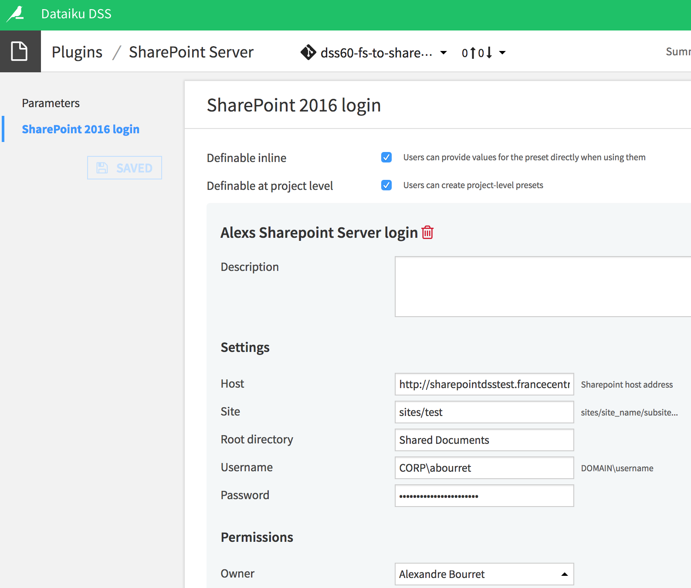
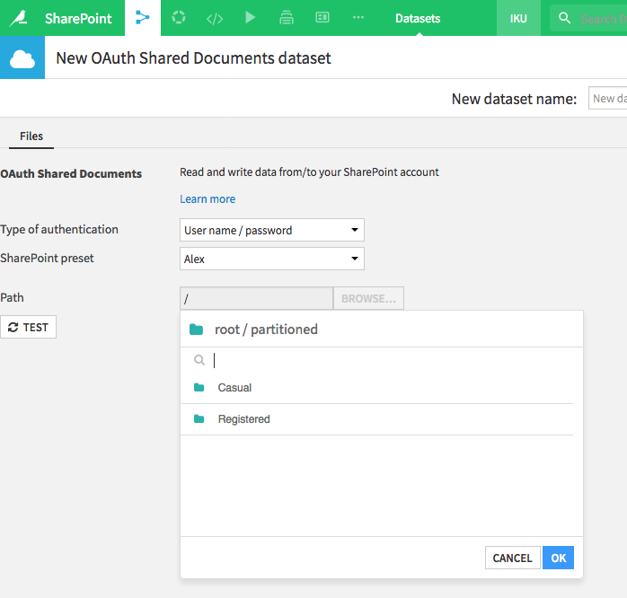

# SharePoint Server Plugin

This Dataiku DSS plugin provides a read / write connector to interact with documents stored on [SharePoint Server](https://products.office.com/sharepoint/sharepoint-server).

### Licence
This plugin is distributed under the Apache License version 2.0

## How to set up

- In DSS, go to **Plugins > Installed > SharePoint > Settings > SharePoint 2016 login**. There, fill in the details of the SharePoint instance you are trying to sync with DSS.

Say a typical URL for files you want to give access to is `https://sharepoint.dataiku.com/sites/rnd/plugins/Shared%20Documents/safe/list.xlsx`

- **Host** is the scheme and the host name of your SharePoint server, here `https://sharepoint.dataiku.com`
- **Site path** is the path to the SharePoint site or subsite you want to give access to. In this example it would be `sites/rnd/plugins`
- **Root directory** is the path to the highest level directory you want your DSS users to have access to. In the current example, `Shared Documents/safe` will let the user browse any files and folders in the sub-directory `safe`. Default value for **Root directory** is `Shared Documents`, but it can also be left blank, in which case the user can access all the document libraries of the `rnd/plugins` site.

## How to use

- In your DSS project flow, select **Dataset > SharePoint**
- Click **Shared Documents** or **Lists**, according to the data source you are trying to sync DSS to.
-  Pick the authentication type and the preset, and browse to the document or folder you want to use as dataset. If the source is a list, you will have know its name beforehand.

### Export data back to Sharepoint

1. On your Sharepoint server, create a destination directory
2. On your DSS project flow, create a SharePoint folder by pressing **Dataset > Folder** and selecting the **SharePoint Server Shared Documents** plugin as **Store into** parameter
3. You will get a red error box at this stage. You need to go to the Settings tab and set the correct type of authentication and connection. Once this is done, type "/" in the path window and press then **Browse**. Navigate to the destination directory created on step 1 and press ok.
4. In your DSS flow, pick the dataset you want to export back to SharePoint, and select the **Export to folder** recipe. In the Export Recipe window, click on **Use existing** and pick the folder you created in steps 2-3. You can change the file format to you liking.
5. **Save** and **Run**, and your dataset will be exported to the SharePoint directory.
